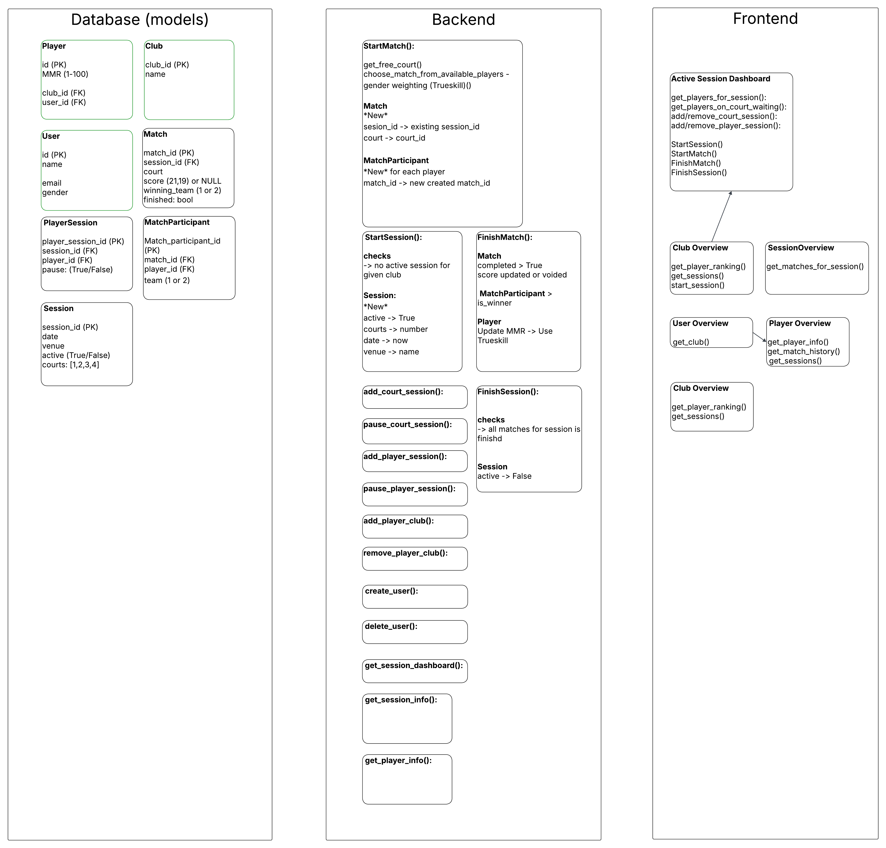
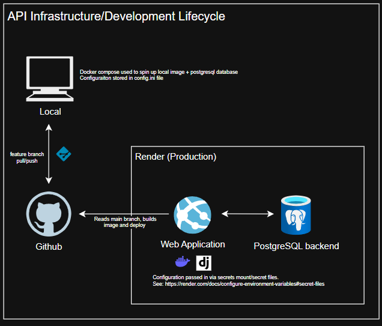

## About the project

This project is a demonstration of a production-oriented Django REST API architecture, focusing on backend infrastructure, containerization, and deployment strategy.

The application itself is initially minimal, consisting of three database models and simple GET endpoints, the primary goal is to showcase infrastructure.

I chose Render to host the application as they offer free-tier for both web services and managed PostgreSQL databases.

<p align="left">
    
</p>

### Built With

* [Django](https://www.djangoproject.com/)
* [DRF](https://www.django-rest-framework.org/)
* [PostgreSQL](https://www.postgresql.org/)

### Environment-based configuration (development vs production)
Bind mounts are used to mirror local source code into the container, code changes reflect instantly without rebuilding the image

`Invoke` is included to simplify common container commands (e.g., migrations, server start)

### PostgreSQL
PostgreSQL is used as the primary database due to its robustness and scalability.

Render provides a managed PostgreSQL service under its free tier.

### Secure secret management
No sensitive information is committed to version control. All secrets are injected via environment variables or mounted secret files at runtime.

### Dockerized deployment
Container-first approach. 

The application is fully containerized using Docker.

Render’s Docker-based web service (free tier for personal use):
* Builds directly from the repository
* Automatically deploys on changes to the configured branch
* Runs the application using a production-ready WSGI server

<p align="left">
  
</p>

## Getting Started

### Prerequisites

To get started with dev, you need to download:
[PostgreSQL](https://www.postgresql.org/download/)

Not necessary but useful for local testing
[Postman](https://www.postman.com/downloads/) - GUI tool for hitting APIs
[PGAdmin](https://www.pgadmin.org/download/) - GUI tool for connecting to postgres databases

### Steps
1. During installation, you will be prompted to set a password for the default postgres superuser. Or create superuse manually using psql: <https://tableplus.com/blog/2018/10/how-to-create-superuser-in-postgresql.html>. This should automatically start a postgres service in the background when you install it. Make sure you store these somewhere.

2. Using pgadmin or psql, connect to your local postgres server and create a database for local environment `createdb your_database_name`

3. Clone this repo to your local machine

    ``` 
    git clone https://github.com/pphamvt/goodminton-matchmaking.git
    cd goodminton-matchmaking
    ```

4. Copy the template settings `/src/config/settings.ini.template` and rename to `/src/config/settings.ini` then update values to match your local environment

5. `cd docker/dev` and run `inv up` to start the container

6. Run `inv makemigrations` and `inv migrate` to create and apply Django migrations.

7. Run `inv create_superuser` to set up an admin account for local application

8. Run `inv runserver`. The application should be accessible via `http://localhost:8000/`. For more invoke commands, check out `/docker/dev/tasks.py` 

## Todo
* Complete building API endpoints

## Future improvements
* Build CI/CD pipelines with GitHub actions
* Automated tests